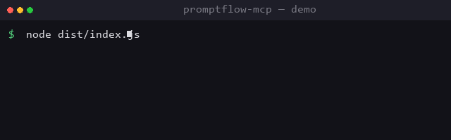

<p align="center">
  
</p>

<h1 align="center">promptflow-mcp</h1>

<p align="center">
  <b>A Model Context Protocol server for prompt template management.</b><br />
  Store, version, search and render prompts — for AI agents and CLI users alike.
</p>

<p align="center">
  <a href="https://www.npmjs.com/package/@modelcontextprotocol/sdk"></a>
  <a href="https://www.typescriptlang.org/"></a>
  <a href="./LICENSE"></a>
  = 18" src="https://img.shields.io/badge/Node-%3E%3D18-339933" />
  
</p>

---

## ✨ Features

- 📚 **Template registry** — save prompts with variables (`{{input}}`)
- 🕘 **Versioning** — every edit creates a new version; nothing is lost
- 🔍 **Search** — full-text search across name, body and tags
- 🧩 **Rendering** — interpolate `{{variables}}` at call time
- 💾 **Local-first** — plain JSON on disk; back up or sync with git
- 🔌 **MCP native** — works with any MCP client (Claude, Cursor, etc.)

<p align="center">
  
</p>

## 🚀 Quick start

```bash
# clone, install, build
git clone https://github.com/DuxuteLi70/promptflow-mcp.git
cd promptflow-mcp
npm install
npm run build

# run the tests
npm test

# start the MCP server
node dist/index.js
```

## 🛠 MCP tools

| Tool | Description |
|------|-------------|
| `prompt.save` | Save or update a prompt template |
| `prompt.list` | List all templates (title, version, tags) |
| `prompt.get` | Get a template, rendered with variables |
| `prompt.search` | Full-text search |
| `prompt.delete` | Remove a template |
| `prompt.versions` | Show version history of a template |

## 💡 Example

```ts
import { TemplateRegistry } from "./src/storage/store.js";

const reg = new TemplateRegistry();

// save a template
const id = reg.save("code-review", "Review this diff:\n{{diff}}", ["review"]);

// render it with variables
const rendered = reg.render(id, { diff: "..." });

// every save keeps history
reg.update(id, "Review this carefully:\n{{diff}}");
reg.versions(id); // [{version: 1, ...}, {version: 2, ...}]
```

## 📦 Project layout

```
promptflow-mcp/
├── src/
│   ├── index.ts            # entry point
│   ├── server.ts           # MCP server wiring
│   ├── tools/              # MCP tool definitions
│   └── storage/            # JSON-file template store
├── tests/                  # unit tests (node:test)
├── docs/                   # design & usage docs
├── examples/               # MCP client config examples
└── assets/                 # logo + demo media
```

## 🤝 Contributing

Pull requests are welcome. For major changes, please open an issue first
to discuss what you would like to change.

## 📄 License

[MIT](./LICENSE)
